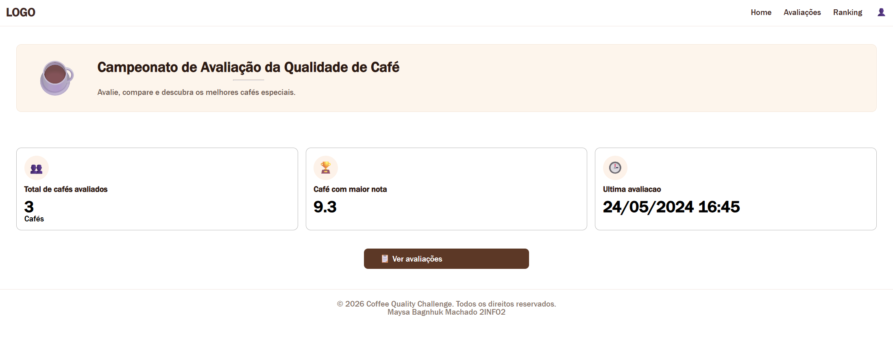
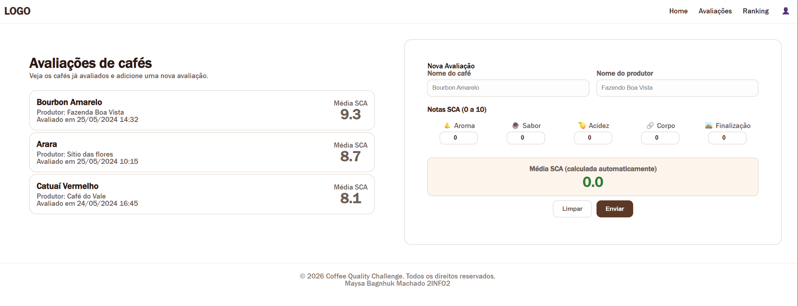
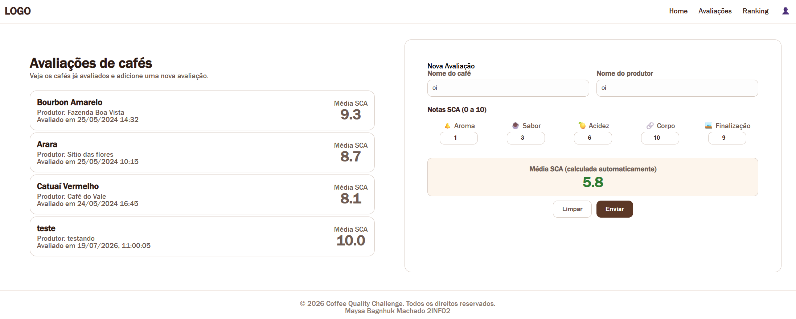
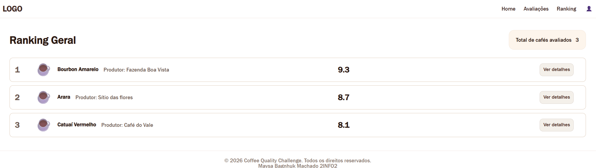

# Coffe Quality Challenge

## Telas

### 1. Homeview

A página Home traz uma visão geral do site, ela foi construída majoritamente com CSS e têm cards com funcionalidades como:

**Total de cafés:** Calcula a quantidade de cafés avaliados utilizando .length do array  
**Maior nota:** Calcula a maior nota com uma função computed com for  
**Última avaliação:** Busca o último café cadastrado com sua posição no array e retorna a datade avaliação  

### 2. Avaliações
  

A página de avaliações conta com uma lista dos cafés já avaliados e funcionalidades para adicionar um novo café

**Lista de Avaliações:** É uma div v-for que traz o array de todos os cafés e seus dados (componente CoffeeCard.vue)  
**Formulário de nova avaliação:** Ele tem campos de texto de identificação e os controles numéricos para calcular a média SCA, com uma função computed. O formulário também tem o botão de limpar que transforma novamente os valores em vazio e o botão de salvar que verifica se os dados estão preenchidos, guarda os dados preenchidos (caso houver) e limpa o formulário  no final (componente RatingForm.vue)

### 3. Ranking

A página de ranking mostra uma visão geral dos melhores cafés com a funcionalidade:

**Lista de cafés ordenada:** Utiliza uma função computed que pega o array e usa o código .sort para as primeiras posições serem ocupadas pelas maiores notas

### Componentes gerais

**AppHeader:** Fica no topo da página e tem o menu de navegação com elementos do router  
**AppFooter:** Fica na base da página com as informações principais